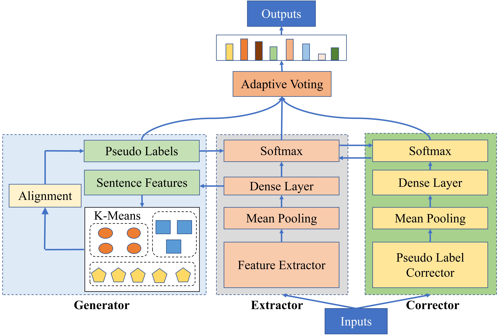
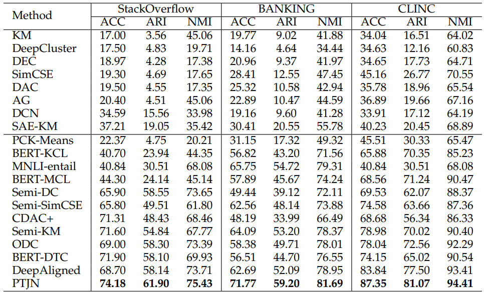

# Robust Pseudo Label Training and Source Domain Joint-training Network (PTJN)
Data and code for paper titled [New User Intent Discovery with Robust Pseudo
Label Training and Source Domain Joint-training](-) (IEEE Intelligent Systems)

*New (User) Intent Discovery (NID)* aims at discovering new intents from unlabeled data and then classifying inputs into proper (known or new) intents. In this paper, we propose a robust Pseudo label Training and source domain Joint training Network (PTJN) to generate robust pseudo labels for unlabeled data and fully utilize prior knowledge from labeled data. 


## Contents
[1. Data](#data)

[2. Model](#model)

[3. Requirements](#requirements)

[4. Running](#running)

[5. Results](#results)

[6. Thanks](#thanks)

[6. Citation](#citation)

## Data
We performed experiments on three public datasets: [clinc](https://aclanthology.org/D19-1131/), [banking](https://aclanthology.org/2020.nlp4convai-1.5/) and [stackoverflow](https://aclanthology.org/W15-1509/), which have been included in our repository in the data folder ' ./data '.

## Model
Our model mainly contains three components: Extractor for feature extraction, Generator for generating pseudo labels through clustering and Corrector for refining the noisy pseudo labels generated by Generator.
<div align=center>

</div>

## Requirements
* python==3.8
* pytorch==1.11.0
* transformers==4.19.2
* scipy==1.8.0
* numpy==1.21.6
* scikit-learn==1.1.1

## Running
Pre-training, training and testing our model through the bash scripts:
```
sh scripts/run.sh
```
You can also add or change parameters in run.sh (More parameters are listed in init_parameter.py)

## Results
<div align=center>

</div>
It should be noted that the experimental results may be different because of the randomness of clustering when testing even though we fixed the random seeds.

## Thanks
Some code references the following repositories:
* [DeepAligned](https://github.com/thuiar/DeepAligned-Clustering)
* [DPN](https://github.com/Lackel/DPN)

## Citation
If our paper or code is helpful to you, please consider citing our paper:
```
@article{an2023new,
  title={New User Intent Discovery with Robust Pseudo Label Training and Source Domain Joint-training},
  author={An, Wenbin and Tian, Feng and Chen, Ping and Zheng, Qinghua and Ding, Wei},
  journal={IEEE Intelligent Systems},
  year={2023},
  publisher={IEEE}
}
```